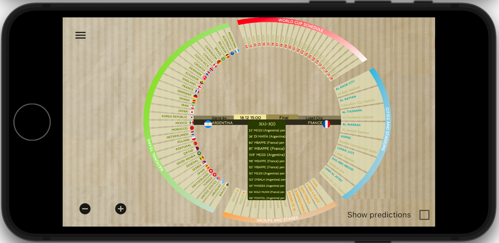
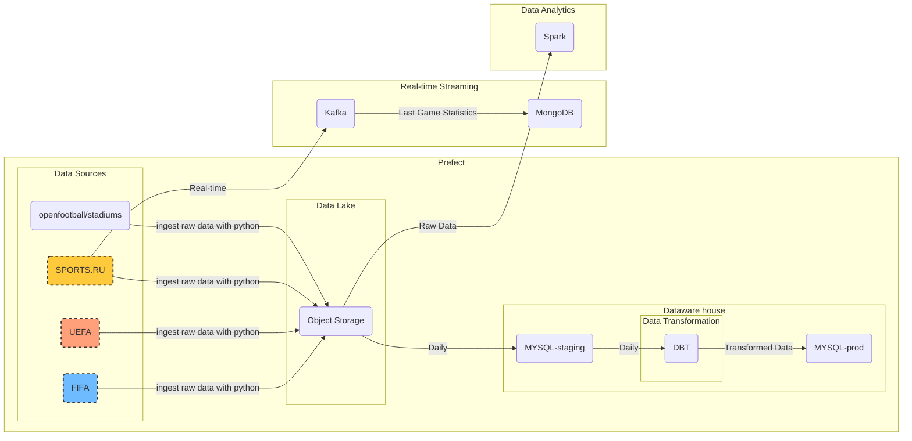
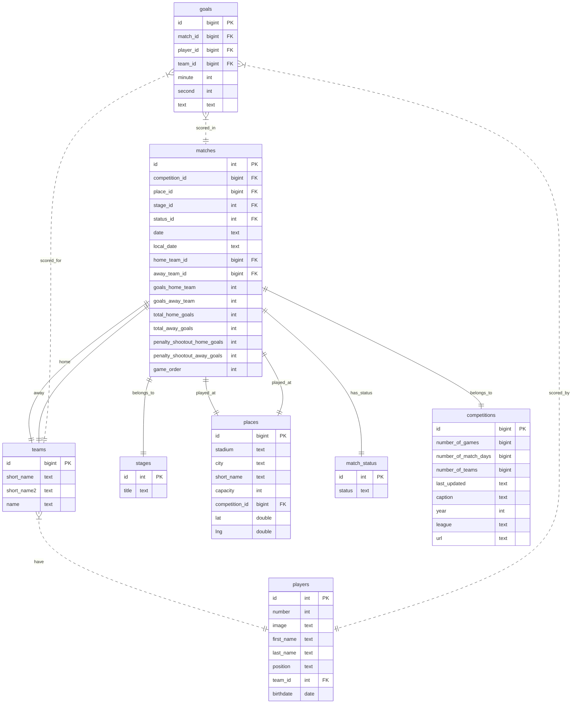

# Football Tournaments Data Archive

<a href="http://euro-stat.com/" target="_blank">LINK TO THE PROJECT</a>

<a href="https://www.youtube.com/watch?v=ld8AY3CgSn4" target="_blank">
Widget logic (video)</a>

## Table of Contents

- [Project Description](#project-description)
- [Technologies](#technologies)
- [Data Pipeline Architecture and Workflow](#data-pipeline-architecture-and-workflow)
  - [(1) Data sources](#1-ingest-historical-and-5-moving-forward-data-to-yandex-object-storage)
  - [(1) Ingest historical and (5) moving-forward data to Yandex object storage](#1-ingest-historical-and-5-moving-forward-data-to-yandex-object-storage)
  - [(2) BigQuery loads data from Cloud Storage](#2-bigquery-loads-data-from-cloud-storage)
  - [(3) Data Warehouse Transformation with dbt and (6) prefect to schedule incremental transformation](#3-data-warehouse-transformation-with-dbt-and-6-prefect-to-schedule-incremental-transformation)
  - [(4) Data Visualization with Looker](#4-data-visualization-with-looker)
- [Reproducability](#reproducability)
  - [Step 1: Build GCP Resources from Local Computer](#step-1-build-gcp-resources-from-local-computer)
  - [Step 2: Setup Workaround on VM](#step-2-setup-workaround-on-vm)
- How to use the visualization?
- [Further Improvements](#further-improvements)
-

## Project Description

This project showcases best practices from [Data Engineering Zoomcamp](https://github.com/DataTalksClub/data-engineering-zoomcamp) course.
The data contains all the basic information about the Football World and European Championships, starting from the very first official World Cup held in Uruguay in 1930.
You can learn about the time and locations of the championships, the participating countries, and the match results here.
Additionally, the project contains details about each individual game, including the time the goals were scored.
Real-time data for the current championship is also displayed.
The visualization was developed separately using the Flask framework and is available at <a href="http://euro-stat.com/" target="_blank">http://euro-stat.com</a>.

# Technologies

- Yandex object storage as the datalake to store our raw dataset.
- Mysql as the data warehouse.
- dbt core as the transformation tool to implement data modeling.
- Self-hosted Prefect core to manage and monitor our workflow.
- Terraform to easily manage the infrastructure setup and changes.
- Flask + HTML + JS + Jinja for data visualisation

## Data sources

- https://www.fifa.com/   fetch matches of World Championships via API
- https://www.uefa.com/   retrieve matches for the European football championship
- https://sports.ru/  retrieve data of other championships, such as the Kyrgyzstan championship. We also update the results and match statistics in real-time using this resource.
- http://clubelo.com/  is a source for predicting the outcome of games based on the Elo rating

Manually and with the help of the GPT chat, we create links between identical entities in different data sources, such as stadiums, games, and players.

# How to use the visualization?
The program interface consists of an elliptical diagram with sets of slices, with each slice representing a different data group such as teams, match schedules, stadiums and cities, groups, and stages of the tournament.

Clicking on each slice of the diagram highlights the associated data structure with the event. Specifically, clicking on:

* Team highlights the days on which the matches will be played, the stadiums, and the groups. The center displays the schedule of all matches.
* Match day highlights all teams playing on that day, the stadiums, and the groups. The center displays the schedule of all matches on that day.
* Stadium
* Stage

In addition to the local slices, there are events when clicking on the external arches:

1. Clicking on "National teams" shows a world map with the participating countries highlighted.
2. Clicking on "Schedule" displays a calendar of all game days.
3. Clicking on "Cities and stadiums" shows marked cities on the map of the host country of the tournament.
4. Clicking on "Groups and stages" displays the full tournament bracket.

"{source}/football/{tournament_id}/{year}/{stage_name}/{date}"

# Datawarehouse (MYSQL  mysql:8.0.27)

Main tables related to each other by foreign keys, with a star schema and a fact table matches:
DDL tables are stored in  `03_datawarehouse_mysql/ddl`

1. Competitions. The considered tournament.
2. Teams. World Cup teams, team icons URL and country code (needed for rendering a world map).
3. Matches (fact table). Played or scheduled matches, goals scored/missed, nominal home team/nominal away team.
4. Stages. All rounds. Group stage/quarterfinals/semifinals/final or rounds for club championships.
5. Places. The location where the match was played, stadium, stadium capacity, stadium name, and location on the world map.
6. Players. Players of teams, their position on the field, age, height.
7. Goals. Goals scored in the match, for which team, and at which minute.

## Further Improvements
There are many things can be improved from this project:

- Implement CI/CD
- Do a comprehensive testing
- Add predictions for games that have not yet been played.
- Convert the widget to the Flutter engine to make the visualization engine cross-platform.